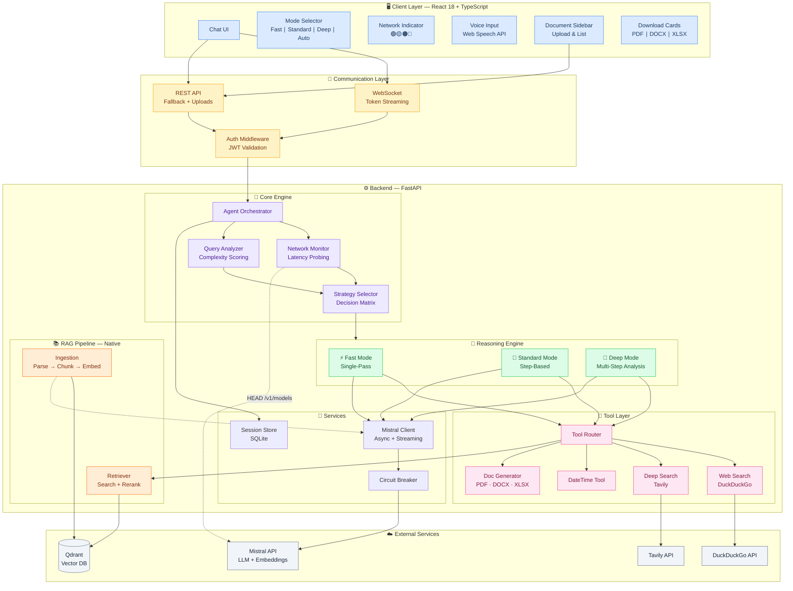
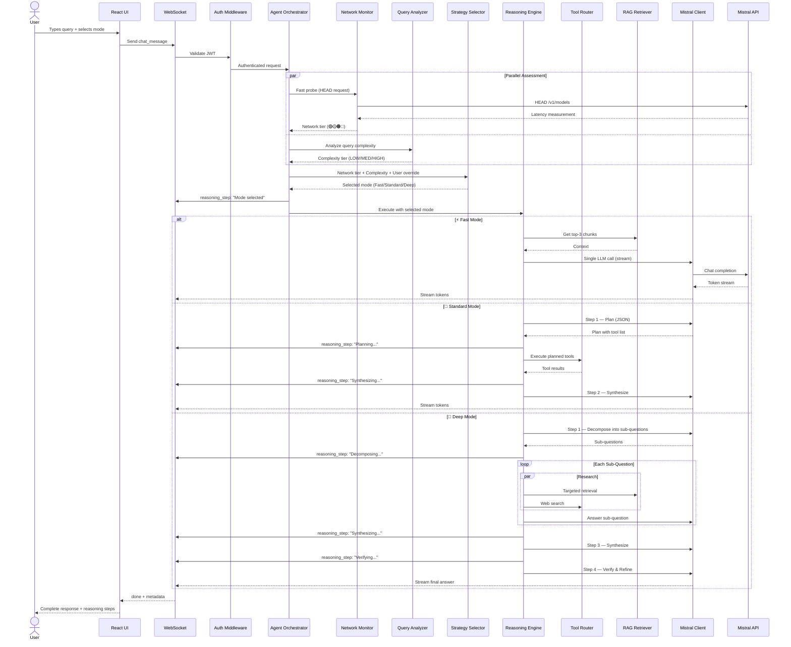
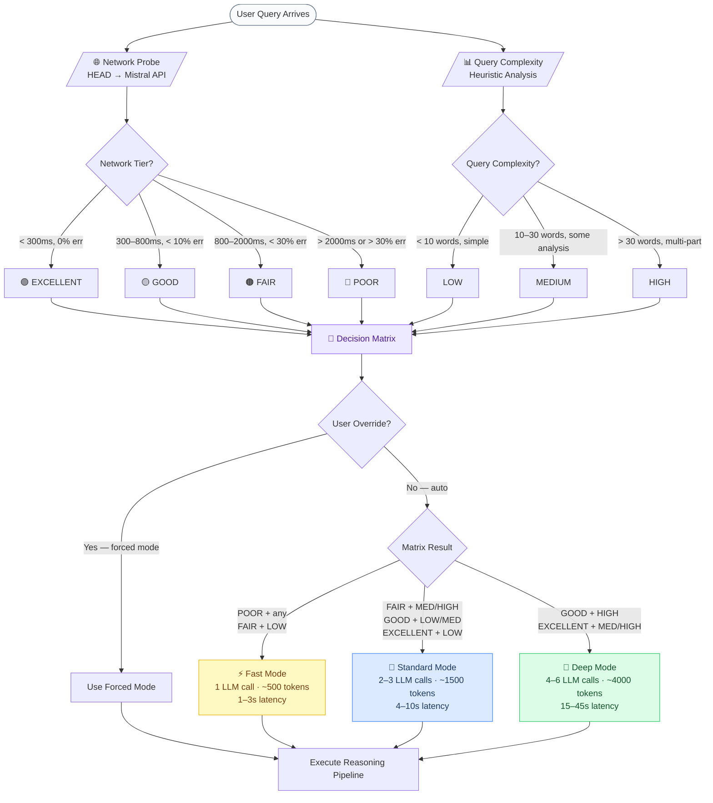
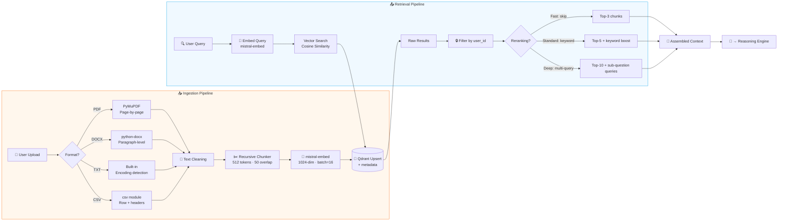
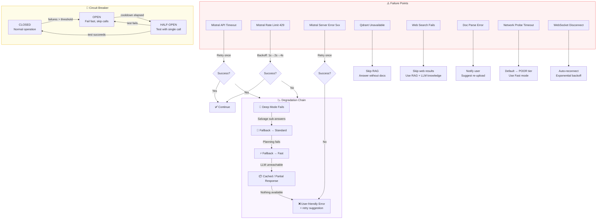
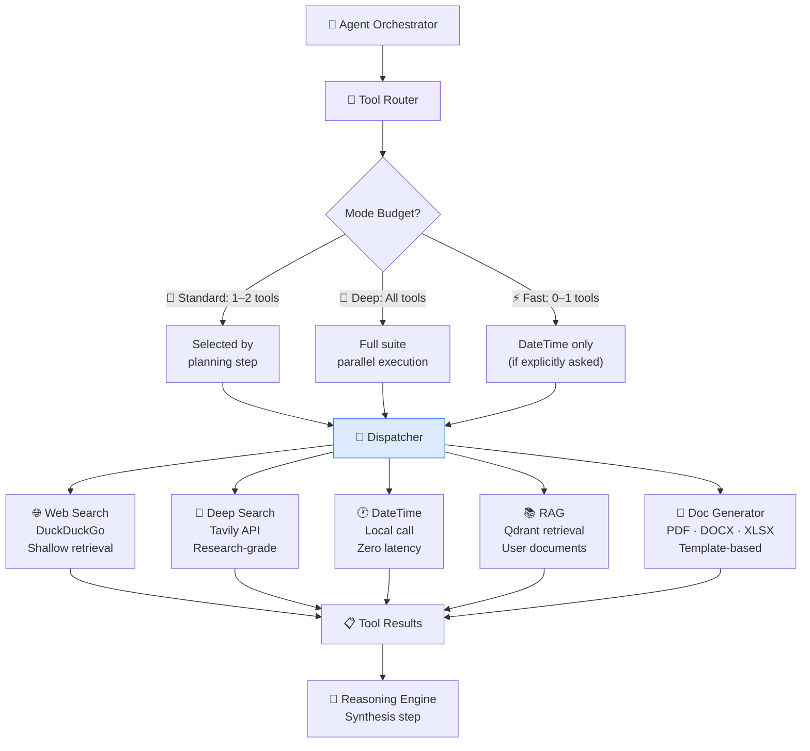
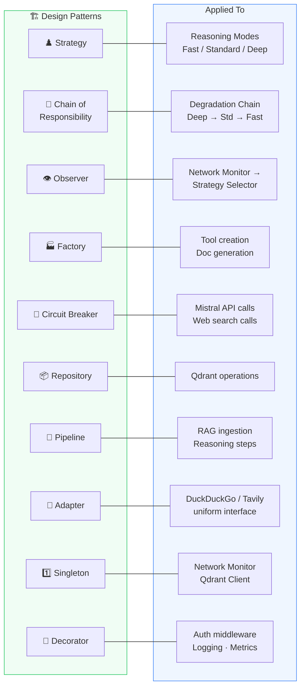
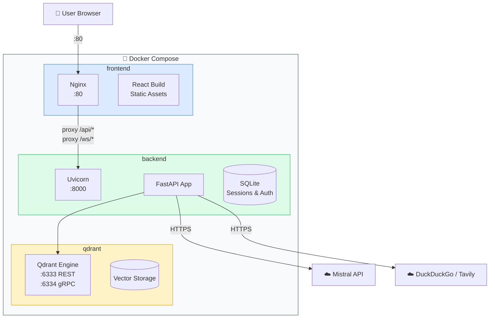

# Architecture Design — Adaptive Reasoning Agent

> **Module 3:** Reasoning depth adapts to network; answer quality stays constant  
> **Stack:** Python 3.11 · FastAPI · React 18 · Qdrant · Mistral API

---

## 1. High-Level System Architecture



---

## 2. Query Lifecycle — Data Flow



---

## 3. Reasoning Mode Selection — Decision Flow



---

## 4. RAG Pipeline — Ingestion & Retrieval



---

## 5. Error Handling & Graceful Degradation



---

## 6. Tool Routing Architecture



---

## 7. Design Patterns Map



---

## 8. Deployment Architecture



---

## 9. Project Structure

```
adaptive-reasoning-agent/
├── backend/
│   ├── main.py                    # FastAPI entry point
│   ├── config.py                  # pydantic-settings configuration
│   ├── api/
│   │   ├── auth.py                # Login, register, JWT
│   │   ├── chat.py                # WebSocket + REST chat
│   │   ├── documents.py           # Upload, list, delete docs
│   │   └── downloads.py           # Serve generated files
│   ├── core/
│   │   ├── agent.py               # Main orchestrator
│   │   ├── network_monitor.py     # Latency probing & tiers
│   │   ├── query_analyzer.py      # Complexity heuristics
│   │   ├── strategy_selector.py   # Decision matrix
│   │   ├── reasoning/
│   │   │   ├── base.py            # Abstract reasoning interface
│   │   │   ├── fast.py            # ⚡ Single-pass
│   │   │   ├── standard.py        # 🔧 Step-based
│   │   │   └── deep.py            # 🔬 Multi-step
│   │   └── prompts/
│   │       ├── fast_prompts.py
│   │       ├── standard_prompts.py
│   │       └── deep_prompts.py
│   ├── tools/
│   │   ├── router.py              # Tool dispatcher
│   │   ├── base.py                # Abstract tool interface
│   │   ├── web_search.py          # DuckDuckGo
│   │   ├── web_deep.py            # Tavily
│   │   ├── datetime_tool.py       # Date/time
│   │   └── doc_generator.py       # PDF, DOCX, XLSX
│   ├── rag/
│   │   ├── ingestion.py           # Upload handling
│   │   ├── parser.py              # PDF, DOCX, TXT, CSV
│   │   ├── chunker.py             # Recursive splitting
│   │   ├── embedder.py            # Mistral embeddings
│   │   ├── vector_store.py        # Qdrant operations
│   │   └── retriever.py           # Search + reranking
│   ├── auth/
│   │   ├── jwt_handler.py         # Token create/validate
│   │   └── middleware.py          # Auth middleware
│   ├── models/
│   │   ├── schemas.py             # Pydantic models
│   │   └── enums.py               # Tiers, modes, tools
│   ├── services/
│   │   ├── mistral_client.py      # Async Mistral wrapper
│   │   ├── session_store.py       # SQLite history
│   │   └── circuit_breaker.py     # Failure protection
│   ├── requirements.txt
│   └── Dockerfile
├── frontend/
│   ├── src/
│   │   ├── App.tsx
│   │   ├── components/
│   │   │   ├── ChatWindow.tsx
│   │   │   ├── MessageBubble.tsx
│   │   │   ├── NetworkIndicator.tsx
│   │   │   ├── ModeSelector.tsx
│   │   │   ├── ReasoningSteps.tsx
│   │   │   ├── DocumentSidebar.tsx
│   │   │   ├── VoiceInput.tsx
│   │   │   └── DownloadCard.tsx
│   │   ├── hooks/
│   │   │   ├── useWebSocket.ts
│   │   │   ├── useVoice.ts
│   │   │   └── useAuth.ts
│   │   └── stores/
│   │       └── chatStore.ts
│   ├── package.json
│   └── vite.config.ts
├── docker-compose.yml
├── architecture.md                # ← This document
└── README.md
```
