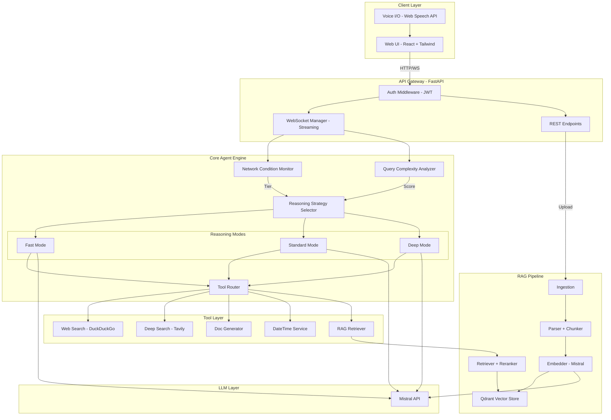
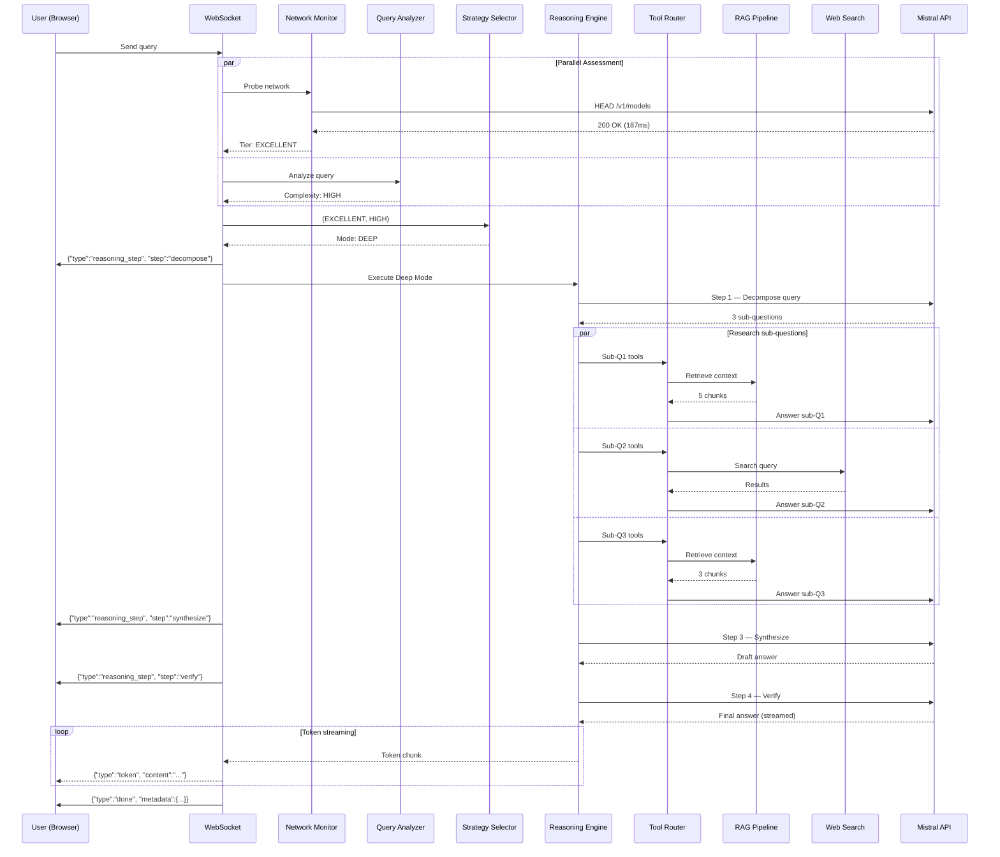
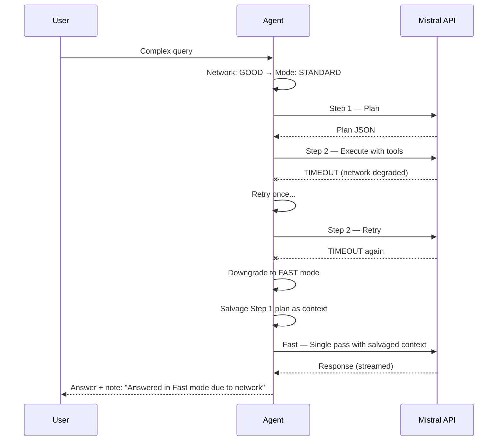

# Adaptive Reasoning Agent — Design Plan

> **Version:** 1.0  
> **Author:** Architecture Team  
> **Stack:** Python 3.11 · FastAPI · React · Qdrant · Mistral API

---

## Table of Contents

1. [Executive Summary](#1-executive-summary)
2. [System Architecture Overview](#2-system-architecture-overview)
3. [Component Deep Dives](#3-component-deep-dives)
   - 3.1 [Network Condition Monitor](#31-network-condition-monitor)
   - 3.2 [Query Complexity Analyzer](#32-query-complexity-analyzer)
   - 3.3 [Reasoning Strategy Selector](#33-reasoning-strategy-selector)
   - 3.4 [Reasoning Engine (3 Modes)](#34-reasoning-engine-3-modes)
   - 3.5 [Tool Router & Orchestrator](#35-tool-router--orchestrator)
   - 3.6 [RAG Pipeline](#36-rag-pipeline)
   - 3.7 [Document Generator](#37-document-generator)
4. [API & Communication Layer](#4-api--communication-layer)
5. [Frontend Design](#5-frontend-design)
6. [Data Models & Schemas](#6-data-models--schemas)
7. [Error Handling & Failure Strategy](#7-error-handling--failure-strategy)
8. [Design Patterns Used](#8-design-patterns-used)
9. [Project Structure](#9-project-structure)
10. [Technology Stack & Justification](#10-technology-stack--justification)
11. [Sequence Diagrams](#11-sequence-diagrams)
12. [Implementation Roadmap](#12-implementation-roadmap)

---

## 1. Executive Summary

The Adaptive Reasoning Agent is an AI chatbot that **maintains constant answer quality** while **dynamically adjusting its reasoning depth** based on real-time network conditions. Under poor connectivity, the agent uses a lightweight single-pass reasoning strategy; under strong connectivity, it performs multi-step decomposition, tool-augmented deep analysis, and cross-referenced synthesis.

**Key differentiator:** The intelligence budget scales with available bandwidth — the *what* (answer) stays the same, only the *how* (reasoning path) changes.

### Core Principles

| Principle | Description |
|-----------|-------------|
| **Adaptive, not degraded** | Slower network = smarter shortcuts, not worse answers |
| **Self-architected reasoning** | No reasoning-specialized models (no o1, no agent frameworks) |
| **Native RAG** | Full retrieval pipeline from scratch — no LangChain, LlamaIndex, etc. |
| **Tool intelligence** | Agent decides which tools to call and how deep to search |
| **Resilience-first** | Graceful fallbacks at every layer |

---

## 2. System Architecture Overview

### 2.1 High-Level Architecture Diagram



### 2.2 Data Flow Summary

```
User Query
  → WebSocket → Auth Check
    → Network Probe (async, ~100ms)
    → Query Complexity Analysis (local, ~5ms)
      → Strategy Selection (decision matrix)
        → Reasoning Pipeline Execution
          → Tool Calls (if needed)
          → LLM Inference (1–6 calls depending on mode)
        → Token-level Streaming back to client
```

---

## 3. Component Deep Dives

### 3.1 Network Condition Monitor

**Purpose:** Continuously assess network quality to the Mistral API and classify it into actionable tiers.

#### Measurement Strategy

```python
# Pseudocode — NetworkMonitor
class NetworkMonitor:
    """Probes network conditions using a sliding window of measurements."""

    WINDOW_SIZE = 10          # Last 10 measurements
    PROBE_INTERVAL = 30       # Seconds between background probes

    def __init__(self, api_base_url: str):
        self.api_base_url = api_base_url
        self.latency_window: deque[float] = deque(maxlen=self.WINDOW_SIZE)
        self.error_window: deque[bool] = deque(maxlen=self.WINDOW_SIZE)

    async def probe(self) -> NetworkSnapshot:
        """Send lightweight HEAD request to API, measure RTT."""
        start = time.monotonic()
        try:
            async with httpx.AsyncClient(timeout=5.0) as client:
                resp = await client.head(f"{self.api_base_url}/models")
            latency_ms = (time.monotonic() - start) * 1000
            self.latency_window.append(latency_ms)
            self.error_window.append(False)
        except Exception:
            self.latency_window.append(5000.0)  # Penalty value
            self.error_window.append(True)
        
        return self._compute_snapshot()

    def _compute_snapshot(self) -> NetworkSnapshot:
        avg_latency = statistics.mean(self.latency_window)
        jitter = statistics.stdev(self.latency_window) if len(self.latency_window) > 1 else 0
        error_rate = sum(self.error_window) / len(self.error_window)
        tier = self._classify(avg_latency, jitter, error_rate)
        return NetworkSnapshot(avg_latency, jitter, error_rate, tier)
```

#### Tier Classification

| Tier | Avg Latency | Jitter | Error Rate | Reasoning Mode Bias |
|------|------------|--------|------------|-------------------|
| 🟢 EXCELLENT | < 300ms | < 50ms | 0% | Deep |
| 🟡 GOOD | 300–800ms | < 150ms | < 10% | Standard / Deep |
| 🟠 FAIR | 800–2000ms | < 500ms | < 30% | Fast / Standard |
| 🔴 POOR | > 2000ms | any | > 30% | Fast |

#### Background Probing

- A background `asyncio.Task` runs every 30s to keep the window fresh.
- On each user query, a **fast probe** (HEAD request, 100ms timeout) is fired to get the freshest reading.
- If the fast probe times out, the cached window data is used.

#### Key Design Decision: Why HEAD Requests?

HEAD requests to `/v1/models` measure true API reachability without consuming tokens. They include TLS handshake, DNS, and routing — the exact path LLM calls will take.

---

### 3.2 Query Complexity Analyzer

**Purpose:** Classify the user's query into a complexity tier (LOW / MEDIUM / HIGH) using lightweight heuristics — **no LLM call needed**.

#### Heuristic Signals

| Signal | Weight | LOW | MEDIUM | HIGH |
|--------|--------|-----|--------|------|
| Word count | 0.20 | < 10 words | 10–30 | > 30 |
| Question marks | 0.10 | 1 | 1–2 | 3+ (multi-part) |
| Analytical keywords | 0.25 | None | 1–2 | 3+ |
| Domain specificity | 0.15 | General | Some jargon | Heavy jargon |
| Instruction complexity | 0.15 | Simple verb | Chain of actions | Conditional logic |
| Reference to documents | 0.15 | None | Mentions docs | Cross-reference |

**Analytical keywords list:** `["compare", "analyze", "evaluate", "explain why", "contrast", "trade-offs", "pros and cons", "step by step", "in detail", "comprehensive", "implications", "relationship between"]`

```python
# Pseudocode — QueryComplexityAnalyzer
class QueryComplexityAnalyzer:
    ANALYTICAL_KEYWORDS = ["compare", "analyze", "evaluate", "explain why", ...]
    
    def analyze(self, query: str) -> ComplexityResult:
        scores = {
            "length": self._score_length(query),
            "questions": self._score_question_count(query),
            "analytical": self._score_analytical_keywords(query),
            "domain": self._score_domain_specificity(query),
            "instruction": self._score_instruction_complexity(query),
            "doc_reference": self._score_doc_reference(query),
        }
        weighted = sum(scores[k] * WEIGHTS[k] for k in scores)
        tier = "LOW" if weighted < 0.33 else "MEDIUM" if weighted < 0.66 else "HIGH"
        return ComplexityResult(tier=tier, score=weighted, signals=scores)
```

**Why no LLM for complexity?** Using an LLM to gauge complexity would cost a round-trip — the exact thing we're trying to minimize on slow networks. Heuristic analysis runs in < 5ms locally.

---

### 3.3 Reasoning Strategy Selector

**Purpose:** Combine network tier + query complexity to select the optimal reasoning mode.

#### Decision Matrix

| | Network: POOR | Network: FAIR | Network: GOOD | Network: EXCELLENT |
|---|:---:|:---:|:---:|:---:|
| **Query: LOW** | ⚡ Fast | ⚡ Fast | 🔧 Standard | 🔧 Standard |
| **Query: MEDIUM** | ⚡ Fast | 🔧 Standard | 🔧 Standard | 🔬 Deep |
| **Query: HIGH** | ⚡ Fast | 🔧 Standard | 🔬 Deep | 🔬 Deep |

#### Auto Mode Logic

```python
class ReasoningStrategySelector:
    MATRIX = {
        ("POOR",      "LOW"):    "fast",
        ("POOR",      "MEDIUM"): "fast",
        ("POOR",      "HIGH"):   "fast",
        ("FAIR",      "LOW"):    "fast",
        ("FAIR",      "MEDIUM"): "standard",
        ("FAIR",      "HIGH"):   "standard",
        ("GOOD",      "LOW"):    "standard",
        ("GOOD",      "MEDIUM"): "standard",
        ("GOOD",      "HIGH"):   "deep",
        ("EXCELLENT", "LOW"):    "standard",
        ("EXCELLENT", "MEDIUM"): "deep",
        ("EXCELLENT", "HIGH"):   "deep",
    }

    def select(
        self, 
        network: NetworkSnapshot, 
        complexity: ComplexityResult,
        user_override: str | None = None  # User can force a mode
    ) -> ReasoningMode:
        if user_override and user_override in ("fast", "standard", "deep"):
            return ReasoningMode(user_override)
        
        mode_key = (network.tier, complexity.tier)
        return ReasoningMode(self.MATRIX[mode_key])
```

**Manual Override:** The user can force a specific mode via the UI toggle (e.g., always use Deep). The auto selector respects this override.

---

### 3.4 Reasoning Engine (3 Modes)

This is the heart of the system. Each mode is a self-contained reasoning pipeline — no agent framework, no reasoning-specialized models. All built using standard Mistral chat completions with carefully crafted prompts and orchestration logic.

#### 3.4.1 ⚡ Fast Mode — Single-Pass Reasoning

**Goal:** Minimum latency, maximum efficiency. One LLM call.

```
┌──────────────────────────────────────────────┐
│  FAST MODE PIPELINE                          │
│                                              │
│  1. Build compact prompt                     │
│     - System: "Answer directly. Be concise." │
│     - User query (as-is)                     │
│     - RAG context (top-3, pre-fetched)       │
│                                              │
│  2. Single LLM call                          │
│     - max_tokens: 512                        │
│     - temperature: 0.3                       │
│     - stream: true                           │
│                                              │
│  3. Stream response directly                 │
└──────────────────────────────────────────────┘
```

**Prompt Template:**
```
SYSTEM: You are a helpful assistant. Answer the user's question directly 
and concisely. If context is provided, use it. Do not explain your 
reasoning process. Get straight to the answer.

CONTEXT (if RAG hits exist):
{top_3_rag_chunks}

USER: {query}
```

**Tool Usage:** Generally skipped. Exception: If the query explicitly requests current date/time, the DateTime tool is called pre-LLM (zero-cost local call).

**Token Budget:** ~500 output tokens  
**Expected LLM calls:** 1  
**Expected latency:** 1–3 seconds

---

#### 3.4.2 🔧 Standard Mode — Step-Based Reasoning

**Goal:** Balanced depth. Structured thinking with selective tool usage.

```
┌──────────────────────────────────────────────────┐
│  STANDARD MODE PIPELINE                          │
│                                                  │
│  Step 1: UNDERSTAND — Parse intent & entities    │
│     - LLM call to classify intent + extract      │
│       key entities + decide needed tools          │
│     - Output: structured JSON plan               │
│                                                  │
│  Step 2: GATHER — Execute tool calls             │
│     - Based on plan: RAG retrieval, web search,  │
│       datetime, etc. (max 2 tools)               │
│     - Parallel execution where possible          │
│                                                  │
│  Step 3: RESPOND — Synthesize final answer       │
│     - LLM call with: query + plan + tool results │
│     - Chain-of-thought prompt: "Think step by    │
│       step, then provide your answer."           │
│     - Stream response                            │
│                                                  │
└──────────────────────────────────────────────────┘
```

**Step 1 Prompt (Planning):**
```
SYSTEM: You are a reasoning planner. Given the user's query, output a JSON 
plan with the following structure:
{
  "intent": "<question|task|analysis|creation>",
  "entities": ["<key terms>"],
  "tools_needed": ["<rag|web_search|datetime|doc_create|none>"],
  "reasoning_notes": "<brief strategy for answering>"
}
Do NOT answer the question. Only plan.

USER: {query}
```

**Step 3 Prompt (Synthesis):**
```
SYSTEM: Answer the user's question using the provided context and tool 
results. Think through your reasoning step-by-step, then give a clear 
final answer.

PLAN: {plan_json}
TOOL RESULTS: {tool_outputs}
RAG CONTEXT: {rag_chunks}

USER: {query}
```

**Tool Usage:** 1–2 tools, selected by the planning step.  
**Token Budget:** ~1500 output tokens across all steps  
**Expected LLM calls:** 2–3  
**Expected latency:** 4–10 seconds

---

#### 3.4.3 🔬 Deep Mode — Multi-Step Analysis

**Goal:** Maximum depth. Decompose, research, synthesize, verify.

```
┌──────────────────────────────────────────────────────┐
│  DEEP MODE PIPELINE                                  │
│                                                      │
│  Step 1: DECOMPOSE                                   │
│     - LLM call: Break query into 2–4 sub-questions   │
│     - Output: list of sub-questions + tool plan      │
│                                                      │
│  Step 2: RESEARCH (per sub-question)                 │
│     - For each sub-question:                         │
│       • Retrieve RAG context (targeted query)        │
│       • Web search if needed (deep mode via Tavily)  │
│       • LLM call to answer sub-question              │
│     - Parallel execution across sub-questions        │
│                                                      │
│  Step 3: SYNTHESIZE                                  │
│     - LLM call: Combine all sub-answers              │
│     - Cross-reference findings                       │
│     - Produce comprehensive draft answer             │
│                                                      │
│  Step 4: VERIFY & REFINE                             │
│     - LLM call: Self-critique the draft              │
│     - Check for contradictions, gaps, accuracy       │
│     - Produce final polished answer                  │
│     - Stream response                                │
│                                                      │
└──────────────────────────────────────────────────────┘
```

**Step 1 Prompt (Decomposition):**
```
SYSTEM: You are a research planner. Break the user's complex question into 
2-4 independent sub-questions that, when answered together, will fully 
address the original query. Output JSON:
{
  "sub_questions": [
    {
      "id": 1,
      "question": "<sub-question>",
      "tools": ["<rag|web_search|web_deep|datetime>"],
      "search_queries": ["<specific search terms>"]
    }
  ],
  "synthesis_strategy": "<how to combine sub-answers>"
}

USER: {query}
```

**Step 4 Prompt (Verification):**
```
SYSTEM: You are a critical reviewer. Examine this draft answer for:
1. Factual consistency across sub-answers
2. Missing information or gaps
3. Contradictions with provided sources
4. Completeness relative to the original question

If issues are found, fix them. Output the final refined answer.

ORIGINAL QUESTION: {query}
DRAFT ANSWER: {draft}
SOURCE MATERIAL: {all_tool_results}
```

**Tool Usage:** Full suite — deep web search (Tavily), RAG, datetime, document generation.  
**Token Budget:** ~4000 output tokens across all steps  
**Expected LLM calls:** 4–6  
**Expected latency:** 15–45 seconds

---

### 3.4.4 Quality Invariance Guarantee

The key challenge: **all three modes must produce answers of equivalent quality**. This is achieved through:

1. **Prompt compensation:** Fast mode uses a more directive, information-dense prompt. Deep mode uses exploratory prompts. The prompt engineering compensates for reasoning depth.
2. **Context front-loading:** In Fast mode, RAG retrieval still runs (pre-cached or with shorter top-k), so the LLM has context even without multi-step reasoning.
3. **Answer templates:** All modes share the same output schema/format expectations, ensuring consistent structure regardless of reasoning depth.
4. **Fallback escalation:** If Fast mode's confidence is low (detected via response length or hedging language), it can escalate to Standard mid-stream.

---

### 3.5 Tool Router & Orchestrator

**Purpose:** Central dispatcher that routes tool calls based on the active reasoning mode and the planning step's output.

#### Tool Registry

```python
class ToolRouter:
    """Routes and executes tool calls with mode-aware constraints."""

    TOOL_REGISTRY = {
        "web_search": {
            "handler": WebSearchTool,          # DuckDuckGo (shallow)
            "allowed_modes": ["standard", "deep"],
            "max_calls_per_mode": {"standard": 1, "deep": 3},
        },
        "web_deep": {
            "handler": DeepWebSearchTool,      # Tavily (deep)
            "allowed_modes": ["deep"],
            "max_calls_per_mode": {"deep": 2},
        },
        "rag": {
            "handler": RAGRetrieverTool,
            "allowed_modes": ["fast", "standard", "deep"],
            "max_calls_per_mode": {"fast": 1, "standard": 1, "deep": 4},
        },
        "datetime": {
            "handler": DateTimeTool,
            "allowed_modes": ["fast", "standard", "deep"],
            "max_calls_per_mode": {"fast": 1, "standard": 1, "deep": 1},
        },
        "doc_create": {
            "handler": DocumentGeneratorTool,
            "allowed_modes": ["standard", "deep"],
            "max_calls_per_mode": {"standard": 1, "deep": 1},
        },
    }

    async def execute(self, tool_name: str, params: dict, mode: str) -> ToolResult:
        spec = self.TOOL_REGISTRY[tool_name]
        if mode not in spec["allowed_modes"]:
            return ToolResult.skipped(f"{tool_name} not available in {mode} mode")
        
        handler = spec["handler"]()
        return await handler.run(**params)
```

#### Parallel Execution

In Deep mode, the router executes tool calls for independent sub-questions **concurrently** using `asyncio.gather()`:

```python
async def execute_batch(self, tool_calls: list[ToolCall], mode: str) -> list[ToolResult]:
    tasks = [self.execute(tc.name, tc.params, mode) for tc in tool_calls]
    return await asyncio.gather(*tasks, return_exceptions=True)
```

---

### 3.6 RAG Pipeline

**Fully custom — no LangChain, LlamaIndex, or RAG libraries.**

#### 3.6.1 Ingestion Pipeline

```
User Upload → Format Detection → Text Extraction → Cleaning → Chunking → Embedding → Qdrant Upsert
```

**Supported Formats:**

| Format | Library | Extraction Method |
|--------|---------|-------------------|
| PDF | PyMuPDF (`fitz`) | Page-by-page text extraction with layout preservation |
| DOCX | `python-docx` | Paragraph-level extraction with heading detection |
| TXT | Built-in | Direct read with encoding detection |
| CSV | Built-in `csv` | Row-by-row with header mapping |

#### 3.6.2 Chunking Strategy

**Recursive Character Text Splitter** (self-implemented):

```python
class RecursiveChunker:
    """Splits text into overlapping chunks respecting semantic boundaries."""

    SEPARATORS = ["\n\n", "\n", ". ", " "]  # Priority order
    CHUNK_SIZE = 512       # tokens (measured via tiktoken)
    CHUNK_OVERLAP = 64     # tokens

    def chunk(self, text: str) -> list[Chunk]:
        chunks = []
        for separator in self.SEPARATORS:
            if len(text) <= self.CHUNK_SIZE:
                break
            # Split at natural boundaries, merge small chunks
            segments = text.split(separator)
            current_chunk = ""
            for segment in segments:
                if len(current_chunk) + len(segment) > self.CHUNK_SIZE:
                    chunks.append(Chunk(
                        text=current_chunk,
                        overlap_prefix=self._get_overlap(chunks),
                    ))
                    current_chunk = segment
                else:
                    current_chunk += separator + segment
        return chunks
```

**Metadata per chunk:**
```python
@dataclass
class ChunkMetadata:
    source_file: str           # Original filename
    page_number: int | None    # For PDFs
    section_heading: str | None # Detected heading
    chunk_index: int           # Position in document
    total_chunks: int          # Total chunks from this doc
    created_at: datetime       # Ingestion timestamp
    user_id: str               # Owner for multi-tenancy
```

#### 3.6.3 Embedding

- **Model:** `mistral-embed` (Mistral's embedding endpoint)
- **Dimension:** 1024
- **Batch size:** 16 chunks per API call (rate-limit aware)
- **Normalization:** L2-normalized before storage

```python
class EmbeddingEngine:
    async def embed_batch(self, texts: list[str]) -> list[list[float]]:
        response = await self.mistral_client.embeddings.create(
            model="mistral-embed",
            inputs=texts,
        )
        return [item.embedding for item in response.data]
```

#### 3.6.4 Vector Store (Qdrant)

**Collection Configuration:**
```python
qdrant_client.create_collection(
    collection_name="documents",
    vectors_config=VectorParams(
        size=1024,            # mistral-embed dimension
        distance=Distance.COSINE,
    ),
    # Payload index for filtered search
    payload_schema={
        "user_id": PayloadSchemaType.KEYWORD,
        "source_file": PayloadSchemaType.KEYWORD,
    },
)
```

**Why Qdrant?** Challenge recommends it. Runs locally via Docker, supports filtering, and has a lightweight Python client. No managed service needed.

#### 3.6.5 Retrieval & Reranking

```python
class RAGRetriever:
    async def retrieve(self, query: str, user_id: str, top_k: int = 5) -> list[RetrievedChunk]:
        # 1. Embed the query
        query_vec = await self.embedder.embed_single(query)
        
        # 2. Vector search with user filter
        results = self.qdrant.search(
            collection_name="documents",
            query_vector=query_vec,
            query_filter=Filter(
                must=[FieldCondition(key="user_id", match=MatchValue(value=user_id))]
            ),
            limit=top_k * 2,  # Over-fetch for reranking
        )
        
        # 3. Score-based reranking
        reranked = self._rerank(query, results)
        
        # 4. Deduplicate overlapping chunks
        deduped = self._deduplicate(reranked)
        
        return deduped[:top_k]

    def _rerank(self, query: str, results: list) -> list:
        """Rerank using a combination of vector similarity + keyword overlap."""
        for r in results:
            keyword_score = self._keyword_overlap(query, r.payload["text"])
            r.combined_score = 0.7 * r.score + 0.3 * keyword_score
        return sorted(results, key=lambda r: r.combined_score, reverse=True)
```

**Mode-Adaptive Retrieval:**

| Mode | top_k | Search Strategy |
|------|-------|-----------------|
| Fast | 3 | Single vector search, no reranking |
| Standard | 5 | Vector search + keyword reranking |
| Deep | 10 | Vector search + keyword reranking + per-sub-question queries |

---

### 3.7 Document Generator

**Purpose:** Create downloadable PDF, DOCX, and XLSX files from LLM-generated content.

| Format | Library | Generation Strategy |
|--------|---------|-------------------|
| PDF | `fpdf2` | Template-based with headers, body, tables |
| DOCX | `python-docx` | Structured doc with styles and formatting |
| XLSX | `openpyxl` | Data-driven with auto-column-width |

```python
class DocumentGenerator:
    async def create(self, doc_type: str, content: dict) -> bytes:
        generators = {
            "pdf": self._generate_pdf,
            "docx": self._generate_docx,
            "xlsx": self._generate_xlsx,
        }
        return await generators[doc_type](content)
```

Generated files are stored temporarily and served via a download endpoint with expiring URLs.

---

## 4. API & Communication Layer

### 4.1 FastAPI Backend

```python
# Main endpoints
POST   /api/auth/login          # JWT login
POST   /api/auth/register       # User registration
GET    /api/auth/me              # Current user info

WS     /api/chat/ws              # Main chat WebSocket (streaming)
POST   /api/chat/send            # Fallback REST chat (non-streaming)

POST   /api/documents/upload     # Upload docs for RAG
GET    /api/documents/list       # List user's documents
DELETE /api/documents/{id}       # Remove document from RAG

GET    /api/downloads/{file_id}  # Download generated docs

GET    /api/network/status       # Current network tier (debug)
GET    /api/config/modes         # Available reasoning modes
PUT    /api/config/mode          # Override reasoning mode
```

### 4.2 WebSocket Protocol

```json
// Client → Server: User message
{
  "type": "chat_message",
  "content": "Compare React and Vue for large applications",
  "session_id": "uuid-v4",
  "mode_override": null  // or "fast" | "standard" | "deep"
}

// Server → Client: Stream tokens
{
  "type": "token",
  "content": "React",
  "metadata": {
    "reasoning_mode": "deep",
    "network_tier": "EXCELLENT",
    "step": "synthesize"  // Current reasoning step
  }
}

// Server → Client: Reasoning step update
{
  "type": "reasoning_step",
  "step_name": "decompose",
  "step_number": 1,
  "total_steps": 4,
  "description": "Breaking down your question into sub-topics..."
}

// Server → Client: Tool call notification
{
  "type": "tool_call",
  "tool": "web_search",
  "query": "React vs Vue performance benchmarks 2025",
  "status": "executing"
}

// Server → Client: Complete
{
  "type": "done",
  "metadata": {
    "total_tokens": 1847,
    "llm_calls": 5,
    "tools_used": ["rag", "web_search"],
    "reasoning_mode": "deep",
    "latency_ms": 12340
  }
}
```

### 4.3 Authentication & Sessions

- **JWT-based auth** with access + refresh tokens
- **Session persistence:** Chat history stored in SQLite per user
- **Session context:** Last 10 messages included in LLM context window
- **Multi-tenancy:** RAG collections filtered by `user_id`

---

## 5. Frontend Design

### 5.1 UI Components

```
┌─────────────────────────────────────────────────────────┐
│  🧠 Adaptive Reasoning Agent                    [👤]    │
├──────────┬──────────────────────────────────────────────┤
│          │  Network: 🟢 Excellent (142ms)               │
│  📁      │  Mode: 🔬 Deep (Auto)   [Fast|Std|Deep|Auto]│
│  Docs    ├──────────────────────────────────────────────┤
│          │                                              │
│  doc1.pdf│  🧑 Compare React and Vue for large apps     │
│  doc2.txt│                                              │
│          │  🤖 [Deep Mode — Step 1/4: Decomposing...]   │
│          │     ├─ Sub Q1: Performance comparison        │
│          │     ├─ Sub Q2: Ecosystem & tooling           │
│          │     └─ Sub Q3: Scalability patterns          │
│          │                                              │
│          │  🤖 [Step 2/4: Researching...]               │
│          │     🔍 Web: "React vs Vue benchmarks 2025"   │
│          │     📚 RAG: Searching your documents...      │
│          │                                              │
│          │  🤖 Based on my analysis, here's a           │
│          │     comprehensive comparison...              │
│          │     ████████████████░░░░ (streaming)         │
│          │                                              │
│          ├──────────────────────────────────────────────┤
│          │  [🎤] Type your message...         [Send ➤]  │
│          │  [📎 Upload] [📄 New Doc Request]            │
└──────────┴──────────────────────────────────────────────┘
```

### 5.2 Key UI Features

| Feature | Implementation |
|---------|---------------|
| **Network indicator** | Real-time dot (🟢🟡🟠🔴) + latency display, updated from WS metadata |
| **Mode selector** | Radio toggle: Fast / Standard / Deep / Auto (default) |
| **Reasoning steps** | Collapsible panel showing current pipeline step in real-time |
| **Tool call display** | Inline indicators showing which tools are being called |
| **Token streaming** | Word-by-word rendering via WebSocket |
| **Document sidebar** | Upload area + list of ingested documents |
| **Voice input** | Microphone button using Web Speech API `SpeechRecognition` |
| **Voice output** | Speaker button using `SpeechSynthesis` on completed responses |
| **Download area** | Generated docs appear as downloadable cards |

### 5.3 Tech Stack

- **React 18** with TypeScript
- **TailwindCSS** for styling
- **Zustand** for state management (lightweight, no Redux overhead)
- **React Markdown** for rendering LLM output

---

## 6. Data Models & Schemas

```python
# --- Core Enums ---
class NetworkTier(str, Enum):
    EXCELLENT = "EXCELLENT"
    GOOD = "GOOD"
    FAIR = "FAIR"
    POOR = "POOR"

class ReasoningMode(str, Enum):
    FAST = "fast"
    STANDARD = "standard"
    DEEP = "deep"
    AUTO = "auto"

class ComplexityTier(str, Enum):
    LOW = "LOW"
    MEDIUM = "MEDIUM"
    HIGH = "HIGH"

class ToolName(str, Enum):
    WEB_SEARCH = "web_search"
    WEB_DEEP = "web_deep"
    RAG = "rag"
    DATETIME = "datetime"
    DOC_CREATE = "doc_create"

# --- Request / Response ---
@dataclass
class ChatRequest:
    content: str
    session_id: str
    mode_override: ReasoningMode | None = None
    attachments: list[str] | None = None

@dataclass
class ChatResponse:
    content: str
    reasoning_mode: ReasoningMode
    network_tier: NetworkTier
    tools_used: list[ToolName]
    llm_calls: int
    total_tokens: int
    latency_ms: float

# --- Internal ---
@dataclass
class NetworkSnapshot:
    avg_latency_ms: float
    jitter_ms: float
    error_rate: float
    tier: NetworkTier

@dataclass
class ComplexityResult:
    tier: ComplexityTier
    score: float  # 0.0 – 1.0
    signals: dict[str, float]

@dataclass
class ReasoningPlan:
    mode: ReasoningMode
    tool_calls: list[ToolCall]
    sub_questions: list[str] | None  # Deep mode only
    synthesis_strategy: str | None   # Deep mode only

@dataclass
class ToolCall:
    name: ToolName
    params: dict
    priority: int  # Execution order

@dataclass
class ToolResult:
    tool: ToolName
    success: bool
    data: Any
    latency_ms: float
    error: str | None = None
```

---

## 7. Error Handling & Failure Strategy

### 7.1 Failure Taxonomy

| Failure | Detection | Recovery |
|---------|-----------|----------|
| **Mistral API timeout** | httpx timeout after 30s | Retry once → downgrade mode → return cached/partial |
| **Mistral API rate limit** | 429 status code | Exponential backoff (1s, 2s, 4s) → queue request |
| **Mistral API error** | 500/503 status | Retry once → return "service unavailable" with context |
| **Qdrant unavailable** | Connection error | Skip RAG → answer without document context |
| **Web search fails** | Timeout / error | Skip web results → answer from RAG + LLM knowledge |
| **Document parse error** | Exception in parser | Return error to user → suggest re-upload |
| **Network probe failure** | All probes timeout | Default to POOR tier → Fast mode (safe fallback) |
| **WebSocket disconnect** | Connection closed | Client auto-reconnect with exponential backoff |
| **Token budget exceeded** | Token counter check | Truncate context → summarize tool results |

### 7.2 Graceful Degradation Chain

```
Deep Mode fails mid-execution
  → Salvage any completed sub-question answers
    → Downgrade to Standard Mode with partial context
      → If Standard also fails
        → Downgrade to Fast Mode
          → If Fast also fails
            → Return cached response or error message
```

### 7.3 Circuit Breaker Pattern

```python
class CircuitBreaker:
    """Prevents cascading failures by stopping calls to failing services."""
    
    FAILURE_THRESHOLD = 5      # Failures before opening circuit
    RECOVERY_TIMEOUT = 60      # Seconds before half-open test

    states: CLOSED → OPEN → HALF_OPEN → CLOSED

    # Applied to: Mistral API, Web Search, Qdrant
```

---

## 8. Design Patterns Used

| Pattern | Where | Why |
|---------|-------|-----|
| **Strategy** | Reasoning modes (Fast/Standard/Deep) | Swap reasoning algorithms at runtime without changing the orchestrator |
| **Chain of Responsibility** | Degradation chain: Deep → Standard → Fast | Each mode tries, passes to next on failure |
| **Observer** | Network monitor → Strategy selector | Network changes automatically trigger mode re-evaluation |
| **Factory** | Tool creation, Document generation | Decouple tool instantiation from usage |
| **Circuit Breaker** | External service calls (API, search) | Prevent cascading failures |
| **Repository** | RAG vector store operations | Abstract storage from retrieval logic |
| **Pipeline** | RAG ingestion, Reasoning steps | Sequential processing with clear stage boundaries |
| **Adapter** | Web search (DuckDuckGo / Tavily) | Uniform interface over heterogeneous search providers |
| **Singleton** | Network monitor, Qdrant client | Single shared instance across requests |
| **Decorator** | Auth middleware, logging, metrics | Cross-cutting concerns without modifying core logic |

---

## 9. Project Structure

```
adaptive-reasoning-agent/
├── backend/
│   ├── main.py                        # FastAPI app entry point
│   ├── config.py                      # Settings via pydantic-settings
│   ├── dependencies.py                # Dependency injection
│   │
│   ├── api/
│   │   ├── __init__.py
│   │   ├── auth.py                    # Login, register, JWT
│   │   ├── chat.py                    # WebSocket + REST chat endpoints
│   │   ├── documents.py               # Upload, list, delete docs
│   │   └── downloads.py               # Serve generated files
│   │
│   ├── core/
│   │   ├── __init__.py
│   │   ├── agent.py                   # Main agent orchestrator
│   │   ├── network_monitor.py         # Latency probing & tier classification
│   │   ├── query_analyzer.py          # Complexity scoring heuristics
│   │   ├── strategy_selector.py       # Decision matrix for mode selection
│   │   │
│   │   ├── reasoning/
│   │   │   ├── __init__.py
│   │   │   ├── base.py               # Abstract reasoning interface
│   │   │   ├── fast.py               # Single-pass reasoning
│   │   │   ├── standard.py           # Step-based reasoning
│   │   │   └── deep.py               # Multi-step analysis
│   │   │
│   │   └── prompts/
│   │       ├── __init__.py
│   │       ├── fast_prompts.py        # Fast mode prompt templates
│   │       ├── standard_prompts.py    # Standard mode prompts
│   │       └── deep_prompts.py        # Deep mode prompts
│   │
│   ├── tools/
│   │   ├── __init__.py
│   │   ├── router.py                  # Tool dispatcher
│   │   ├── base.py                    # Abstract tool interface
│   │   ├── web_search.py             # DuckDuckGo integration
│   │   ├── web_deep.py               # Tavily integration
│   │   ├── datetime_tool.py          # Current date/time
│   │   └── doc_generator.py          # PDF, DOCX, XLSX creation
│   │
│   ├── rag/
│   │   ├── __init__.py
│   │   ├── ingestion.py              # Document upload handling
│   │   ├── parser.py                 # PDF, DOCX, TXT, CSV parsing
│   │   ├── chunker.py               # Recursive text splitting
│   │   ├── embedder.py              # Mistral embedding calls
│   │   ├── vector_store.py          # Qdrant operations
│   │   └── retriever.py             # Search + reranking
│   │
│   ├── auth/
│   │   ├── __init__.py
│   │   ├── jwt_handler.py           # Token creation & validation
│   │   ├── models.py                # User model
│   │   └── middleware.py            # Auth middleware
│   │
│   ├── models/
│   │   ├── __init__.py
│   │   ├── schemas.py               # Pydantic models
│   │   └── enums.py                 # NetworkTier, ReasoningMode, etc.
│   │
│   ├── services/
│   │   ├── __init__.py
│   │   ├── mistral_client.py        # Async Mistral API wrapper
│   │   ├── session_store.py         # SQLite chat history
│   │   └── circuit_breaker.py       # Failure protection
│   │
│   ├── utils/
│   │   ├── __init__.py
│   │   ├── token_counter.py         # Token counting without tiktoken
│   │   └── logger.py               # Structured logging
│   │
│   ├── tests/
│   │   ├── test_network_monitor.py
│   │   ├── test_query_analyzer.py
│   │   ├── test_strategy_selector.py
│   │   ├── test_reasoning_modes.py
│   │   ├── test_rag_pipeline.py
│   │   └── test_tools.py
│   │
│   ├── requirements.txt
│   └── Dockerfile
│
├── frontend/
│   ├── src/
│   │   ├── App.tsx
│   │   ├── main.tsx
│   │   ├── components/
│   │   │   ├── ChatWindow.tsx
│   │   │   ├── MessageBubble.tsx
│   │   │   ├── NetworkIndicator.tsx
│   │   │   ├── ModeSelector.tsx
│   │   │   ├── ReasoningSteps.tsx
│   │   │   ├── DocumentSidebar.tsx
│   │   │   ├── VoiceInput.tsx
│   │   │   └── DownloadCard.tsx
│   │   ├── hooks/
│   │   │   ├── useWebSocket.ts
│   │   │   ├── useVoice.ts
│   │   │   └── useAuth.ts
│   │   ├── stores/
│   │   │   ├── chatStore.ts
│   │   │   └── configStore.ts
│   │   └── types/
│   │       └── index.ts
│   ├── package.json
│   ├── tailwind.config.js
│   └── vite.config.ts
│
├── docker-compose.yml                 # Backend + Qdrant + Frontend
├── architecture.md                    # This document
└── README.md
```

---

## 10. Technology Stack & Justification

| Component | Technology | Justification |
|-----------|-----------|---------------|
| **LLM** | Mistral API (`mistral-large-latest`) | Required by challenge. Supports streaming, tool-call format, embeddings. |
| **Embeddings** | `mistral-embed` | Same provider = consistent tokenization, no extra API key. |
| **Vector DB** | Qdrant (Docker) | Recommended by challenge. Self-hosted, fast, Python-native client. |
| **Backend** | FastAPI (Python 3.11) | Async-native, WebSocket support, Pydantic validation, fast. |
| **Frontend** | React 18 + TypeScript + Tailwind | Modern, component-driven, excellent WS support. |
| **Web Search** | DuckDuckGo (`duckduckgo-search`) | Free, no API key, good for shallow search. |
| **Deep Search** | Tavily API | Quality results for deep research, free tier available. |
| **PDF Parsing** | PyMuPDF (`fitz`) | Fast, reliable, no Java dependency. |
| **DOCX Parsing** | `python-docx` | Native Python, handles styles and headings. |
| **PDF Generation** | `fpdf2` | Lightweight, no external dependencies. |
| **Auth** | `python-jose` + `passlib` | Standard JWT implementation. |
| **HTTP Client** | `httpx` | Async support, timeout control, connection pooling. |
| **DB (sessions)** | SQLite via `aiosqlite` | Zero-config, serverless, sufficient for chat history. |
| **Voice** | Web Speech API (browser) | No backend infra needed, works in Chrome/Edge. |

---

## 11. Sequence Diagrams

### 11.1 Auto Mode — Full Request Lifecycle



### 11.2 Degradation Scenario — Network Drop Mid-Request



---

## 12. Implementation Roadmap

### Phase 1 — Core Foundation (Days 1–2)
- [ ] Project scaffolding (backend + frontend)
- [ ] Mistral API async client with streaming
- [ ] Network monitor with tier classification
- [ ] Query complexity analyzer
- [ ] Strategy selector with decision matrix
- [ ] Fast mode reasoning pipeline
- [ ] Basic WebSocket chat endpoint
- [ ] Minimal React chat UI

### Phase 2 — Reasoning Depth (Days 2–3)
- [ ] Standard mode (plan → execute → respond)
- [ ] Deep mode (decompose → research → synthesize → verify)
- [ ] Tool router with mode-aware constraints
- [ ] DateTime tool
- [ ] DuckDuckGo web search tool
- [ ] Token-level streaming through WebSocket
- [ ] Reasoning step indicators in UI

### Phase 3 — RAG Pipeline (Days 3–4)
- [ ] Document upload endpoint
- [ ] PDF, DOCX, TXT, CSV parsers
- [ ] Recursive chunker
- [ ] Mistral embedding integration
- [ ] Qdrant setup + upsert/search
- [ ] Retriever with reranking
- [ ] RAG tool integration in reasoning pipeline
- [ ] Document sidebar in UI

### Phase 4 — Polish & Bonus (Days 4–5)
- [ ] Document generator (PDF, DOCX, XLSX)
- [ ] Deep web search (Tavily)
- [ ] Auth system (JWT + sessions)
- [ ] Chat history persistence
- [ ] Error handling & circuit breaker
- [ ] Graceful degradation chain
- [ ] Voice input/output
- [ ] Network indicator + mode selector UI
- [ ] Architecture diagram for submission
- [ ] Docker Compose setup
- [ ] README with setup instructions

---

## Appendix A: Key Mistral API Configuration

```python
# Chat completion (reasoning)
MISTRAL_CHAT_MODEL = "mistral-large-latest"

# Embeddings (RAG)
MISTRAL_EMBED_MODEL = "mistral-embed"

# Mode-specific parameters
MODE_CONFIGS = {
    "fast": {
        "model": MISTRAL_CHAT_MODEL,
        "max_tokens": 512,
        "temperature": 0.3,
        "top_p": 0.9,
    },
    "standard": {
        "model": MISTRAL_CHAT_MODEL,
        "max_tokens": 1500,
        "temperature": 0.5,
        "top_p": 0.95,
    },
    "deep": {
        "model": MISTRAL_CHAT_MODEL,
        "max_tokens": 4000,
        "temperature": 0.7,
        "top_p": 0.95,
    },
}
```

## Appendix B: Environment Variables

```env
# Mistral
MISTRAL_API_KEY=your-key-here
MISTRAL_API_BASE=https://api.mistral.ai/v1

# Qdrant
QDRANT_HOST=localhost
QDRANT_PORT=6333
QDRANT_COLLECTION=documents

# Tavily (optional)
TAVILY_API_KEY=your-key-here

# Auth
JWT_SECRET=your-secret
JWT_ALGORITHM=HS256
JWT_ACCESS_TOKEN_EXPIRE_MINUTES=30
JWT_REFRESH_TOKEN_EXPIRE_DAYS=7

# App
APP_HOST=0.0.0.0
APP_PORT=8000
SQLITE_DB_PATH=./data/sessions.db
UPLOAD_DIR=./data/uploads
GENERATED_DIR=./data/generated
```

## Appendix C: Docker Compose

```yaml
version: "3.9"

services:
  backend:
    build: ./backend
    ports:
      - "8000:8000"
    environment:
      - MISTRAL_API_KEY=${MISTRAL_API_KEY}
      - QDRANT_HOST=qdrant
    volumes:
      - ./data:/app/data
    depends_on:
      - qdrant

  qdrant:
    image: qdrant/qdrant:latest
    ports:
      - "6333:6333"
    volumes:
      - qdrant_data:/qdrant/storage

  frontend:
    build: ./frontend
    ports:
      - "3000:3000"
    depends_on:
      - backend

volumes:
  qdrant_data:
```
